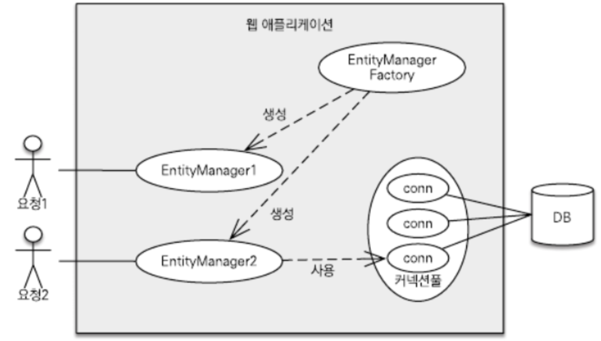

# 영속성 컨텍스트

태그: Study
진행도: 완료

# 1. Entity Manger Factory , Entity Manger



엔티티 매니저 팩토리는 이름 그대로 엔티티 매니저를 생성하는 곳으로, 여러 스레드가 동시에 접근해도 안전하므로 서로 다른 스레드 간에 공유가 가능하다는 특징이 있다.

엔티티 매니저는 엔티티를 조회/저장/수정/삭제 하는 등 엔티티와 관련된 모든 일을 처리하는 `관리자`와 같은 역할이다. 아래와 같은 특징들을 갖는다. 

- 앤티티 매니저는 필요할 때마다 엔티티 매니저 팩토리에서 생성 가능하다.
- 엔티티 매니저는 여러 스레드가 동시에 접근하면 동시성 문제가 발생하므로 스레드 간에 절대 공유하면 안 됨.
- 데이터베이스 연결이 꼭 필요한 시점까지 커넥션을 얻지 않고, **보통 트랜잭션을 시작할 때 커넥션(HikariCP)을 획득**한다.

> 여기서 엔티티 매니저는 왜 지연 획득(Lazy Acquisition) 을 사용하여 커넥션 풀을 얻는 것일까?  
  ⇒ DB의 커넥션 풀은 한정적인 리소스이기에, 효율적 사용을 위해 커넥션을 지연시키는 것이다.
> 

## 2. 영속성 컨텍스트

영속성 컨텍스트는 `Entity를 영구적으로 저장하는 환경` 을 의미한다. 엔티티 매니저는 여기에다 Entity를 저장하고 관리한다. 아래의 persist 메서드로 엔티티를 저장하게 된다. 

```java
em.persist(member);
```

## 3. Entity Life Cycle


> Entity 생명 주기는 위와 같이 비영속, 영속, 준영속, 삭제 4가지 상태를 갖는다.
> 

- **비영속**
    
    순수한 객체로, 영속성 컨텍스트나 데이터베이스와 전혀 관련이 없는 상태를 말한다.
    
    ```java
    Memebr member = new Member();
    member.setId("member_1");
    member.setUsername("회원_1");
    ```
    

- **영속**
    
    엔티티 매니저를 통해 엔티티를 `영속성 컨텍스트에 저장한 상태`를 말한다. (영속성 컨텍스트에 의해 관리 되기 시작)
    
    ```java
    em.persist(member);
    ```
    

- 준영속
    
    영속성 컨텍스트가 관리하다가 분리된 엔티티의 상태를 말한다. 특정 엔티티를 준영속 상태로 만드려면 em.detach() 를 호출하거나, em.close() 를 호출해서 영속성 컨텍스트를 닫거나, em.clear() 을 호출해서 영속성 컨텍스트를 초기화하면 된다.
    

- 삭제
    
    영속성 컨텍스트와 데이터베이스에서 삭제된 엔티티의 상태를 말한다.  [ em.remove(member) ] 
    

## 3. 영속성 컨텍스트 특징

> 영속성 컨텍스트와 식별자 값
> 

⇒  영속성 컨텍스트는 엔티티를 식별자 값(`@Id`로 테이블의 기본 키와 매핑한 값)로 구분한다. 
     따라서 영속 상태는 반드시 식별자 값이 있어야 한다.

> 영속성 컨텍스트와 데이터베이스 저장
> 

⇒ JPA는 보통 트랜잭션을 커밋하는 순간 영속성 컨텍스트에 새로 저장된 엔티티를 DB에 반영하는데,  이를 
    `플러시(flush)`라고 한다.

영속성 컨텍스트로 엔티티를 관리하면 아래와 같은 장점이 있다

- 1차 캐시 및 동일성 보장
- 트랜잭션을 지원하는 쓰기 지연
- 더티 체킹(변경 감지)
- 지연 로딩

## `1차 캐시`


영속성 컨텍스트는 내부에는 엔티티를 보관하는 저장소가 있는데, 이를 1차 캐시라고 한다. 
1차 캐시는 트랜잭션 시작부터 종료 시까지 유효하다. 

만약 em.find()를 호출했는데 엔티티가 1차 캐시에 없으면 엔티티 매니저는 DB를 조회해 엔티티를 생성한다. 
그리고 1차 캐시에 저장한 후에 영속 상태의 엔티티를 반환하게 된다.

따라서, 1차 캐시 내부에 존재하는 엔티티들은 “영속 상태” 에 속한다. 

**영속 엔티티의 동일성 보장** 

⇒ 1차 캐시로 인해, 동일한 엔티티에 대한 동일한 인스턴스 객체를 보장한다. 한 번 조회한 엔티티는 영속성 컨텍스트 내부의 1차 캐시에 존재하기 때문에 다시 조회해도 DB 호출이 없고, 캐시 내부의 객체를 그대로 반환한다.

- 2차 캐시
    
    
    

## `쓰기 지연`(Entity 등록)


JPA의 영속성 컨텍스트 가 제공하는 성능 최적화 기법 중 하나로, 트랜잭션 커밋 시점까지 INSERT/ UPDATE/DELETE 쿼리를 SQL 저장소에 저장하여 모아둔다. 쿼리를 지연시켜 커밋 시, 한 번에 실행하는 방식.

즉, 영속성 컨텍스트의 변경 내용을 DB에 동기화하는 작업인 **Flush**가 바로, SQL 저장소에 모아둔 쿼리들을 DB로 보내는 작업이다. 

### **FlushMode 설정**

영속성 컨텍스트의 변경 내용을 DB에 Flush하는 타이밍을 제어하는 설정으로, `EntityManager` 단위로 설정하거나, `@PersistenceContext(flushMode = FlushModeType.COMMIT)`로 주입 시 설정 가능

### **Batch Size 튜닝**

JPA/Hibernate는 기본적으로 INSERT/UPDATE 쿼리를 건당 실행하는데, `hibernate.jdbc.batch_size` 설정을 통해 여러 건의 SQL을 배치(batch)로 묶어 전송 가능이 가능하다.

```java
spring.jpa.properties.hibernate.jdbc.batch_size=50
```

자세한 건 [Batch Size 튜닝 및 Entity 객체 프록시 호출 ](https://www.notion.so/Batch-Size-Entity-1ca303e25222806cb5fbeaaae9b4fbc5?pvs=21) 을 참고하자 ! 

## `더티 체킹`(변경 감지)


JPA로 엔티티를 수정할 때는 단순히 엔티티를 조회해서 데이터만 변경하면 된다. 이렇게 엔티티의 변경 사항을 데이터베이스에 자동으로 반영하는 기능을 더티 체킹이라 한다.

더티 체킹은 영속성 컨텍스트가 관리하는 영속 상태의 엔티티에만 적용된다. 엔티티를 영속성 컨텍스트에 보관할 때, 최초 상태를 복사해서 저장해 두는데 이것을 스냅샷이라 한다. 플러시 시점에 스냅샷과 엔티티를 비교해서 변경된 엔티티를 찾아 수정 쿼리를 생성하여 커밋한다.

```java
1. 트랜잭션을 커밋하면 엔티티 매니저 내부에서 플러시가 호출된다.
2. 엔티티와 스냅샷을 비교해서 변경된 엔티티를 찾는다.
3. 변경된 엔티티가 있으면 수정 쿼리를 생성해서 쓰기 지연 SQL 저장소에 보낸다.
4. 쓰기 지연 저장소의 SQL을 DB에 보낸다.
5. DB 트랜잭션을 커밋한다.
```

> JPA 변경 감지 기본 전략
> 

JPA는 기본적으로 엔티티의 모든 필드를 업데이트한다. 이렇게 모든 필드를 업데이트하면 데이터 전송량이 증가하는 단점이 있지만, 아래와 같은 장점 때문에 모든 필드를 업데이트한다.

- 모든 필드를 사용하면 수정 쿼리가 항상 같다. 따라서 애플리케이션 로딩 시점에 수정 쿼리를 미리 생성해두고 재사용할 수 있다.
- 데이터베이스에 동일한 쿼리를 보내면 데이터베이스는 이전에 한 번 파싱된 쿼리를 재사용할 수 있다.

만약 필드가 많거나 저장되는 내용이 너무 크면 수정된 데이터만 사용해서 동적으로 UPDATE SQL을 생성하는 전략을 선택하면 된다. (@DynamicUpdate 사용)

상황에 따라 다르지만 컬럼이 대략 30개 이상이면 기본 방법보다 동적 수정 쿼리가 빠르다고 한다.

### Entity 삭제

엔티티를 삭제하려면 삭제 대상 엔티티를 조회해야 한다.

```java
Member memberA = em.find(Member.class, "memberA");
em.remove(memberA);
```

em.remove()에 넘겨진 엔티티를 삭제한다. 마찬가지로 엔티티를 즉시 삭제하는 것이 아니라 삭제 쿼리를 
쓰기 지연 SQL 저장소에 등록한다. 이후 트랜잭션을 커밋해서 플러시를 호출하면 실제 데이터베이스에 삭제 쿼리를 전달한다.

### 준영속

> 영속 상태였다가 더는 영속성 컨텍스트가 관리하지 않는 상태를 준영속 상태라 한다.
> 
1. `detach()`

memberA 엔티티를 생성하고 영속화한 다음 em.detach(memberA)를 호출하는 순간 1차 캐시부터 쓰기 지연 SQL 저장소까지 해당 엔티티를 관리하기 위한 모든 정보가 제거된다.

1. `clear()`

em.clear()를 호출하는 순간 영속성 컨텍스트에 있는 모든 것이 초기화된다. 영속성 컨텍스트에 관리되던 모든 엔티티들이 준영속 상태가 된다.

1. `close()`

영속성 컨텍스트가 종료된다. 영속성 컨텍스트에 관리되던 모든 엔티티들이 준영속 상태가 된다.

1. `merge()`


준영속 상태 또는 비영속 엔티티를 다시 영속 상태로 변경하려면 병합을 사용하면 된다. 준영속 상태의 엔티티를 받아서 그 정보로 새로운 영속 상태의 엔티티를 반환한다.

```java
Member mergeMember = em.merge(member);
```