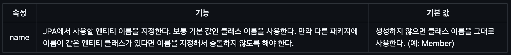

# Entity Mapping, 기본키 전략

태그: Study
진행도: 완료

### **@Entity**



JPA를 사용해서 테이블과 매핑할 클래스는 `@Entity` 어노테이션을 필수로 붙여야 한다.

- 기본 생성자는 필수다(파라미터가 없는 `public`또는 `protected` 생성자).
- `final` 클래스, `enum`, `interface`, `inner` 클래스에는 사용할 수 없다.
- 저장할 필드에 `final`을 사용하면 안 된다.

### @Table


### **Hibernate 스키마 자동 생성**


```java
spring:
  jpa:
    generate-ddl: true
    hibernate:
      ddl-auto: create
    show-sql: true
```

### Primary Key Mapping 전략

- 직접 할당: 기본 키를 애플리케이션에 직접 할당한다.
    - `@Id`로 매핑하는 방식으로, `em.persist()` 로 엔티티를 저장하기 전에 애플리케이션에서 기본 키를 직접 할당
    
    ```java
    @Id
    private Long id;
    ```
    
- 자동 생성: 대리 키 사용 방식
    - IDENTITY: 기본 키 생성을 데이터베이스에 위임한다.
    - SEQUENCE: 데이터베이스 시퀸스를 사용해서 기본 키를 할당한다.
    - TABLE: 키 생성 테이블을 사용한다.

### **IDENTITY 전략**

기본 키 생성을 데이터베이스에 위임하는 것으로, `@GenerateValue`의 strategy 속성 값을 
`GenerationType.IDENTITY`로 지정하면 된다. 이 전략을 사용하면 JPA는 기본 키 값을 얻어오기 위해 데이터베이스를 추가로 조회한다.

```java
@Entity
public class Board {
    
    @Id
    @GeneratedValue(strategy = GenerationType.IDENTITY)
    private Long id;
```

엔티티가 영속 상태가 되려면 식별자가 반드시 필요하다. 따라서 `em.persist()`를 호출하는 즉시 INSERT SQL이 데이터베이스에 전달되므로, 이 전략은 트랜잭션을 지원하는 쓰기 지연이 동작하지 않는다. 

⇒ 이는 대량 INSERT 시, persist() 시점마다 DB에 접근해야 하기에 성능 저하를 일으킬 수 도 있다. 

| 장점 항목 | 설명 |
| --- | --- |
| 설정 간편 | 별도 시퀀스 생성 없이 `AUTO_INCREMENT`만으로 즉시 사용 가능 |
| DB 자동 관리 | DB가 ID를 직접 생성하므로 중복/충돌 위험 없음 |
| 코드 작성 단순 | ID를 수동으로 지정하거나 생성기를 구성할 필요 없음 |
| 단건 저장에 최적 | `persist()` 시점에 바로 insert 및 ID 반환 → 간단한 CRUD에 적합 |
| 직관적인 동작 흐름 | DB → insert → ID 생성 → 엔티티 ID 할당까지 흐름이 명확함 |

> @Id  vs @Id + @GeneratedValue(strategy = GenerationType.IDENTITY)
> 

전자는 직접 ID 값을 지정해줘야 하며, 기본 키를 수동으로 설정할 때 사용한다. JPA가 ID 생성 전략을 알 수 없기 
때문에 persist() 호출 전에 ID가 반드시 세팅되어 있어야 한다. 

후자는 DB가 ID 값을 생성하며, JPA는 ID 생성을 위임하기 위해, `persist()` 시점에 즉시 insert 쿼리를 실행하여 ID를 받아온다. 

### **SEQUENCE 전략**

주로 **Oracle, PostgreSQL**처럼 **시퀀스(Sequence)를 지원하는 데이터베이스**에서 사용되는 전략이며, 
시퀀스는 단순한 **숫자 증가기 (1, 2, 3, 4, …)** 이며, **DB 차원에서 중복 없는 숫자를 생성한다.** 

## **@Column**

> 객체 필드를 테이블 컬럼에 매핑하는 역할을 한다. (아래는 참고)
> 


- IF, `@Column` 제약 조건을 추가한다면 ?
    
    
    

### @**Enumerated**

