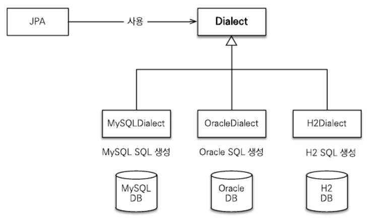

# JPA 는 왜 쓰는 것일까?

태그: Study
진행도: 완료

### 1. SQL를 직접 다룰 때 문제점

데이터베이스는 객체 구조와는 다른 구조를 가지므로 객체를 데이터베이스에 직접 저장하거나 조회할 수 없다. 
따라서 아래 예제 코드와 같이 개발자가 객체지향 애플리케이션과 데이터베이스 중간에서 SQL과 JDBC API를 사용해서 변환 작업을 아래와 같이 직접 해주어야 한다.

```java
String sql="INSERT INTO MEMBER (MEMBER_ID, NAME) VALUES(?,?)";
    psmt.setString(1,member.getMemberId());
    psmt.setString(2,member.getName());
    psmt.excuteUpdate(sql);
```

> 만약, 테이블이 100개라면 객체를 데이터베이스에 CRUD하려면 위와 같은 작업을 무수히 해야 한다.
> 

또한, 비즈니스 요구사항을 모델링한 객체를 엔티티라 하는데, SQL에 모든 것을 의존하는 상황에서는 개발자들이 엔티티를 신뢰하고 사용할 수 없기에, 결국 DAO를 열어서 어떤 SQL이 실행되고 어떤 객체들이 함께 조회되는지 일일이 확인해야 한다. 이것은 진정한 의미의 계층 분할이 아니다.

### **2. 패러다임 불일치**

패러다임 불일치는 객체와 관계형 데이터베이스는 지향하는 목적이 서로 다르므로 둘의 기능과 표현 방법도 다름을 의미한다. 

- 객체와 달리 테이블에는 `상속`이라는 개념이 존재하지 않는다.
- 객체는 `참조`를 사용해서 다른 객체와 연관관계를 가지고 참조에 접근해서 연관된 객체를 조회한다. 반면에 
테이블은 외래 키를 사용해서 다른 테이블과 연관관계를 가지고 조인을 사용해서 연관된 테이블을 조회한다.

# JPA?


ORM (Object-Relational Mapping)은 이름 그대로 **객체와 관계형 데이터베이스를 매핑한다는 뜻**이다. 객체와 테이블을 매핑해서 패러다임 불일치 문제를 개발자 대신 해결해준다.

JPA는 자바 ORM 기술에 대한 API 표준 명세로, 쉽게 이야기하면 인터페이스를 모아둔 것이라고 생각하면 된다. 따라서 JPA를 사용하기 위해서 JPA를 구현한 ORM 프레임워크를 선택해야 하는데, 주로 hibernate를 사용한다.

**1) 유지보수와 생산성 향상**

- JPA에서 제공하는 메서드를 통해 CRUD를 수행하기 때문에 생산성이 향상된다.
- 필드의 변경이나 수정이 일어나도 JPA가 대신 처리해주므로 별도의 SQL 수정 과정이 사라진다.

**2) 패러다임 불일치 해결**

- JPA는 상속, 연관 관계, 객체 그래프 탐색, 비교 등 패러다임의 불일치를 해결해 준다.

**3) 성능**

- JPA는 애플리케이션과 데이터베이스 사이에서 다양한 성능 최적화 기회를 제공한다.

**4) 데이터 접근 추상화와 벤더 독립성**

- JPA는 애플리케이션과 데이터베이스 사이에 추상화된 데이터 접근 계층을 제공해서 특정 데이터베이스 기술에 종속되지 않도록 한다.



> `Dialect` 는 Hibernate가 **어떤 데이터베이스에 맞는 SQL을 생성할지 결정**하기 위해 사용하는 설정이다.
> 

## **Q. JPA를 사용하는 이유**

A. 객체에는 상속, 참조, 비교 등 다양한 개념이 존재하는 반면에, 관계형 데이터베이스(RDBMS)는 이러한 개념들이 존재하지 않아 패러다임 불일치 문제가 발생합니다. 
이 문제를 해결하기 위해서는 객체와 DB 사이의 변환 작업을 개발자가 직접 해줘야 하고, 데이터 중심의 설계를 해야 합니다. JPA는 이러한 문제들을 직접 해결해 주기 때문에 사용합니다.